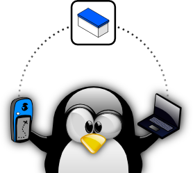

[](https://travis-ci.org/andreaspeters/opencache-manager)
[](https://liberapay.com/~10452/donate)


Dies ist ein Fork der eingestellen Geocaching Software "OpenCacheManager" 
(http://opencachemanage.sourceforge.net/).  
User Ziel ist die Weiterentwickligung der Software. Hierfuer benoetigen wir 
jedoch Eure Unterstuetzung. Bitte testet die Software, benutzt sie, oeffnet 
Feature-Requests und spendet auch etwas. Denn wie auch der Entwickler vor 
uns, so haben auch wir Familie! Wenn genug Geld zusammen kommt, kann für bestimmte
Tätigkeiten einen externer Entwickler beauftragen. :-)

### Kompilieren/Installieren

#### Archlinux:

```
yaourt opencachemanager-git

```

#### Debian (bis 9.x)/Ubuntu:

```
sudo apt-get install libwebkit-cil-dev libwebkit1.1-cil \
	gtk-sharp2 libgtk2.0-cil libgtk2.0-cil-dev \
	libgconf2.0-cil libgconf2.0-cil-dev \
	libdbus2.0-cil libdbus2.0-cil-dev libdbus-glib2.0-cil libdbus-glib2.0-cil-dev

./configure
make
make install
```

#### Debian 10 (Buster) / Ubuntu 18.04

Neuere Linux-Distributionen liefern die Pakete **libwebkit-cil-dev** und **libwebkit1.1-cil** nicht
mehr aus, da die Software nicht länger gepflegt wird. Bis zur Umstellung auf libwebkit2 ist daher die
Installation der Pakete aus anderen Quellen erforderlich.

Doch zunächst:

```
sudo apt-get install  gettext gtk-sharp2 libgtk2.0-cil libgtk2.0-cil-dev \
	libgconf2.0-cil libgconf2.0-cil-dev \
	libdbus2.0-cil libdbus2.0-cil-dev libdbus-glib2.0-cil libdbus-glib2.0-cil-dev \
	libwebkitgtk-1.0.0 libjavascriptcoregtk-1.0.0
```

Unter Debian ist explizit noch erforderlich:

```
sudo apt-get install geoclue-2.0 libgeoclue-2.0 libegl1-mesa
```

Optional unter Ubuntu:
```
sudo apt-get install libcanberra-gtk-module
```

Installation der entfallenen Bibliotheken:

```
wget http://ftp.debian.org/debian/pool/main/w/webkit-sharp/libwebkit1.1-cil_0.3-7_all.deb
wget http://ftp.debian.org/debian/pool/main/w/webkit-sharp/libwebkit-cil-dev_0.3-7_all.deb
dpkg -i libwebkit1.1-cil_0.3-7_all.deb libwebkit-cil-dev_0.3-7_all.deb
```


Es folgt der klassische Dreisatz:

```
./configure
make
make install
sudo make install
osm
```

Anschliessend kann man es mit dem Befehl "ocm-gtk" starten.


### Anmerkungen/Probleme

* Die Fedora 27, CentOS 7.4 und RHEL 7.4 liefern webkitgtk ebenfalls bereits nicht mehr.
* Unter SuSE Leap 42.3 ist die Erstellung bislang problemlos
